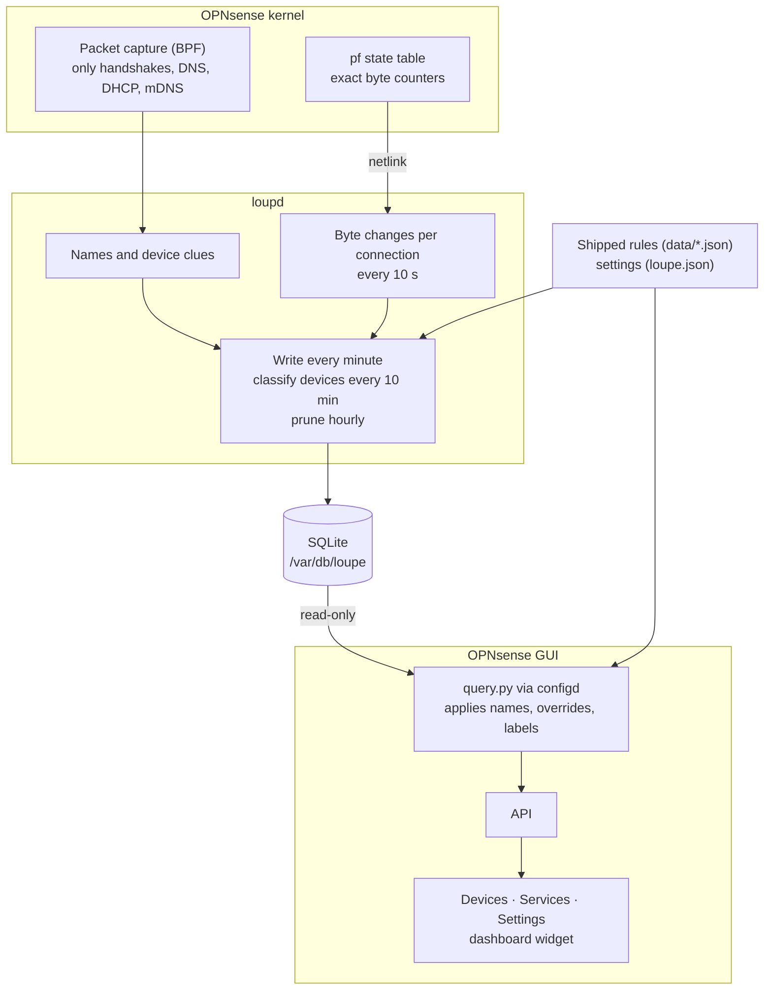

# Loupe design notes

What Loupe does, how, what was considered instead, and what is known not to work yet. For contributors and reviewers; the README is the user-facing overview.

## Goal

Per-device history of *who talked to what, how much, and when* — device → site/service, bytes each way, over time — inside the OPNsense GUI, light enough to leave running on a small box.

Non-goals: blocking or policy (that is the firewall's job), alerts, deep packet inspection, live per-packet views. Zenarmor and ntopng cover those.

## Overview

## Data sources

Everything Loupe knows comes from these. Required ones stop Loupe from working if missing; optional ones only cost names or detail.

| Source | Gives | When | Needed |
|---|---|---|---|
| pf state table (pf's netlink interface; `pfctl -ss -vv` text as fallback) | bytes and packets per connection, both directions, before NAT | every 10 s | required |
| Packet capture (BPF) on the selected interfaces | TLS SNI and QUIC names, DNS answers sent to devices, DHCP requests (host name, vendor class, parameter list), mDNS (host names, models, services) | continuously | required |
| ARP and IPv6 neighbour tables (sysctl, as `arp -an` / `ndp -an` show them) | IP → MAC, to tie traffic to a device | every 60 s | required |
| Interface addresses (`getifaddrs()`) | which networks are local | at start, every 10 min | required |
| Unbound cache (`dump_cache` over Unbound's TLS control port) | names for connections opened before Loupe started | at start | optional (Unbound) |
| dnsmasq leases and static hosts (`/var/db/dnsmasq.leases`, `/var/etc/dnsmasq-hosts`) | device names | every 10 min | optional (Kea and ISC DHCP not read yet: LOUPE-15) |
| IEEE vendor list (`/usr/local/opnsense/contrib/ieee/oui.csv`, shipped with OPNsense) | MAC maker | at start | optional |
| Settings (`/usr/local/etc/loupe.json`, from the OPNsense config via a template) | interfaces, retention, your service and device names | daemon: at start (Apply restarts it); reports: every query | required |
| Shipped rules (`data/devices.json`, `data/services.json`) | device types, icons, makers, Apple model names; service names, address ranges, ports, VPN providers | at start / every query | required |

## Bytes: pf state counters

Every connection through the router has a pf state with exact packet and byte counters for both directions. On the LAN interface that state is recorded **before NAT**, with the device's own address. `lib/pfstate.py` reads the state table every 10 seconds over pf's generic netlink family (`pfctl`, the interface `pfctl` itself uses; `lib/pfnl.py`), falling back to parsing `pfctl -ss -vv` text if netlink fails, keeps states whose `origif` is a selected interface and that have exactly one local endpoint, and records the change in each state's counters since the last read. The first read after start is only a baseline, so restarts never double count.

pf keeps a closed state for at least its close timeouts (TCP fin-wait 45 s, single-packet UDP 30 s), longer than the 10-second poll, so every connection's final counters are seen. Counters are `initiator:responder`; the device-opened direction decides which side is "up".

Measured on the development box, Loupe's totals matched the WAN interface counters: upload exact, download ~96% (the rest is traffic that never had a LAN-side state, such as the router's own).

## Names

Each connection is named, in order of trust:

1. its own TLS ClientHello (SNI) or QUIC Initial (decrypted with the public RFC 9001 / 9369 keys), matched by the exact 4-tuple;
2. the DNS answer *that device* received for the server address;
3. any device's DNS answer for that address (`dns*`).

The kernel BPF filter (`capture.py`) passes only handshake starts, the continuation segment of large ClientHellos, DNS answers, DHCP client messages and mDNS; bulk traffic never reaches userland. At start, Unbound's cache (`unbound-control dump_cache`) seeds the DNS map so connections opened before Loupe started still get names.

A state's name is fixed once given, so a later, unrelated DNS answer for the same address does not rename it.

## Devices

A device is its MAC address (IP as fallback). Clues: the MAC vendor (OPNsense's IEEE list), the private-MAC bit, DHCP host name / vendor class / parameter list, mDNS host names, models and services, and the domains it talks to.

Identification is **data, not code**: `data/devices.json` holds the rules, the icon and maker per type, and Apple model names; `lib/devid.py` only matches them, in a fixed order of trust (mDNS model → host name → hosting role → strong mDNS services → DHCP vendor → DHCP fingerprint → domains it talks to → other mDNS services → MAC vendor → private MAC). Users add their own rules in *Settings → Device rules* (`rules` in `loupe.json`); they are checked before all shipped rules, invalid patterns are refused when saved and skipped with a log line if they get through, and per-device overrides still win at report time. Every shipped rule carries synthetic example evidence that the tests run through the engine, which catches typos and rules that take over other rules' devices.

## Storage

SQLite at `/var/db/loupe/loupe.db`, WAL mode: `loupd` is the only writer; `query.py` opens it read-only from configd.

- `flows_5m` / `flows_1h`: per bucket, device, server, port, protocol and name — bytes up/down, packets, connections, and when loupd last added to the row. Kept 30 days / 365 days by default.
- `lookups`: names each device looked up or connected to, per day, including ones that moved no data. 30 days.
- `devices`: detected facts only.

Names, user overrides and service labels are applied **when a report is built**, never stored: editing a service name or resetting a device fixes all history immediately.

## GUI

Standard OPNsense MVC: one page with tabs (Devices, Services, Settings), UIBootgrid grids fed by `searchRecordsetBase`, the standard dialog and form partials, a dashboard widget, configd actions for the service and for queries, templates for `rc.conf.d` and `loupe.json`, and `rc.d` running the daemon under `daemon -r`.

## Alternatives considered

| Option | Why not |
|---|---|
| **NetFlow / Insight (flowd)** | On a bridged LAN it misses LAN→internet packets on ingress, so uploads appear only after NAT with the router's address and per-device upload is wrong; long flows are exported every 30 minutes; no names. |
| **Full packet capture / DPI** | Far more CPU per byte, and records more than the goal needs (privacy). |
| **pflog** | Logs rule matches, not byte counts. |
| **Suricata EVE flow records** | Heavy to run just for accounting; Suricata is optional and often off. |
| **Zenarmor / ntopng** | Broader products with their own engines; Loupe aims to be small and native. |
| **DuckDB instead of SQLite** | Built for large analytic scans; no concurrent reader while a writer has the file open, a large extra package, and Loupe's data is small. |

## Footprint

On a gigabit home link running on an Intel N150: about 0.5–0.8% of one core idle, a few percent during a full-speed transfer, 30–50 MB of memory. Database growth is still being measured over a full month.

## Known limits

- **Hidden names:** Encrypted Client Hello, DNS-over-HTTPS that bypasses the router, VPNs and relays (iCloud Private Relay) hide the real site. Loupe labels VPNs (and the provider when the device looked up its domain) and Private Relay as what they are.
- **Containers and VMs behind one MAC** look like one device; a distro rule can be swayed by a container's update traffic.
- **Private MACs** can rotate, which splits a device's history until the user names it or turns the private address off for the network.
- **Multicast and broadcast** traffic is not counted.
- **Traffic that never crosses the router** (device to device on the LAN) is invisible by design.

## Untested / open risks

- **DHCP servers other than dnsmasq:** lease-file names are read from dnsmasq only; Kea and ISC DHCP installs lose that clue.
- **IPv6** is implemented (filters, parsing) but has not seen real traffic yet.
- **VLANs / several LAN interfaces:** supported by configuration, tested only on one bridged LAN.
- **Large state tables:** the state table is read every 10 seconds. The kernel hands it over in ~1.5 ms for 1,000 states, but decoding it in Python costs ~25 µs per state either way (netlink fields or `pfctl` text, `tools/bench_pfstate.py`): ~0.25% of a core at 1,000 states, ~12% at 50,000. Beyond that it would need a compiled helper or a longer poll interval (pf keeps closed states only 30–45 s, so the interval can't go much past 20 s).
- **External commands:** none in normal operation. pf states, neighbour tables, interface addresses, the filter compiler (libpcap) and Unbound's cache are all read natively; `pfctl` runs only if pf's netlink interface fails, and loupd logs which source it is using.
- **pf's netlink attributes** (`netpfil/pf/pf_nl.h`) are a kernel interface that can grow between FreeBSD releases; Loupe reads only the fields it needs by number and keeps the text parser as a fallback.
- **Long report periods:** reports up to 30 days scan the 5-minute table; at a full month of data, reports beyond 48 hours should read the hourly table.

## Privacy

Loupe records which device talked to which site name and how much — not page contents, URLs, or anything inside encrypted connections. In a workplace, people should be told that this is recorded; per-person browsing history is regulated in many places.
